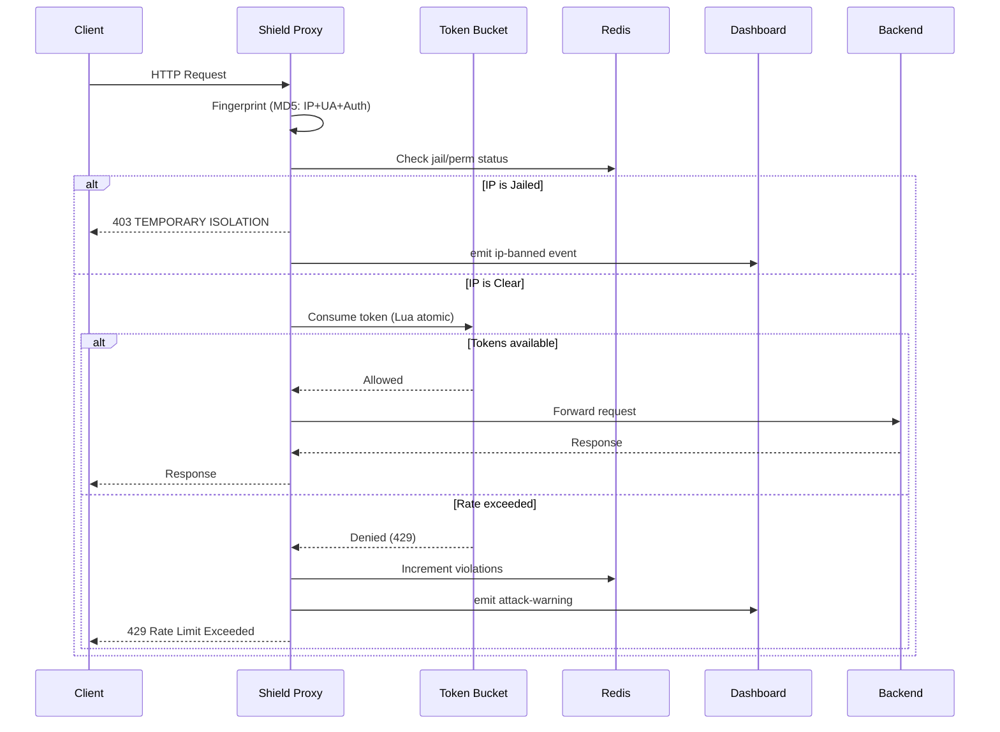

# Sentinel Shield — Technical Report

**Project:** Anti-DoS Protection System  
**Version:** 2.6  
**Date:** February 13, 2026  
**Author:** Development Team

---

## 1. Executive Summary

Sentinel Shield is an enterprise-grade Denial-of-Service (DoS) mitigation system designed as a transparent reverse proxy layer that sits between client traffic and a backend application. The system provides real-time threat detection, intelligent rate limiting using a Token Bucket algorithm, multi-tier IP isolation, and a full-featured monitoring dashboard — all deployable via a single command using Docker.

The solution is composed of three principal components:

| Component | Role | Technology |
|-----------|------|------------|
| **Shield-Proxy** | Reverse proxy + rate limiter + dashboard | Node.js, Express, Socket.IO, Redis |
| **Backend-App** | Protected API server | Node.js, Express |
| **Attacker** | Attack simulation tool | Node.js, Axios |

---

## 2. System Architecture

### 2.1 High-Level Architecture

```
┌──────────────┐       ┌─────────────────────────────────────────────┐       ┌────────────────┐
│              │       │            SENTINEL SHIELD                  │       │                │
│              │       │   ┌──────────────┐  ┌──────────────────┐    │       │                │
│   Clients    │──────▶│   │  Rate Limiter │  │  Reverse Proxy   │───▶│  Backend App   │
│  / Attackers │       │   │  (Token Bucket)│  │  (http-proxy-mw) │    │       │  (Express.js)  │
│              │       │   └──────┬───────┘  └──────────────────┘    │       │                │
│              │       │          │                                   │       │  /health       │
│              │       │   ┌──────▼───────┐  ┌──────────────────┐    │       │  /heavy        │
│              │       │   │    Redis      │  │  Dashboard HUD   │    │       │  /api/data     │
│              │       │   │  (Persistence)│  │  (Socket.IO)     │    │       │                │
│              │       │   └──────────────┘  └──────────────────┘    │       │                │
└──────────────┘       └─────────────────────────────────────────────┘       └────────────────┘
```

### 2.2 Request Flow



### 2.3 Deployment Architecture (Docker)

The system deploys via Docker Compose with two containers:

| Container | Image | Purpose |
|-----------|-------|---------|
| `sentinel-shield` | `node:20-alpine` | Proxy + Dashboard |
| `sentinel-redis` | `redis:alpine` | Persistent state storage |

The backend application runs on the **host machine** and is accessed from Docker via `host.docker.internal`.

---

## 3. Core Algorithm — Token Bucket Rate Limiter

### 3.1 Algorithm Description

The rate limiter uses the **Token Bucket** algorithm, a standard industry approach for traffic shaping. Each client fingerprint is assigned a virtual bucket of tokens:

- Tokens **refill** at a constant rate (e.g., 5 tokens/second)
- Each request **consumes** 1 token
- Maximum bucket capacity limits burst traffic (e.g., 20 tokens)
- When the bucket is empty, requests are **rejected** with HTTP 429

### 3.2 Atomic Redis Execution (Lua Script)

To ensure thread-safety and atomic execution in a high-concurrency environment, the token bucket logic is implemented as a **Lua script** executed inside Redis:

```lua
local key = KEYS[1]
local now_ms = tonumber(ARGV[1])
local capacity = tonumber(ARGV[2])
local refill_rate = tonumber(ARGV[3])
local ttl = tonumber(ARGV[4])

-- Load current state
local state = redis.call("HMGET", key, "tokens", "last")
local tokens = tonumber(state[1]) or capacity
local last = tonumber(state[2]) or now_ms

-- Refill tokens based on elapsed time
local delta = math.max(0, now_ms - last)
tokens = math.min(capacity, tokens + (delta / 1000.0) * refill_rate)

-- Consume 1 token
local allowed = 0
local retry_after = 0
if tokens >= 1.0 then
    allowed = 1
    tokens = tokens - 1.0
else
    retry_after = math.ceil((1.0 - tokens) / refill_rate)
end

-- Persist state
redis.call("HMSET", key, "tokens", tokens, "last", now_ms)
redis.call("EXPIRE", key, ttl)

return { allowed, tokens, retry_after }
```

**Key advantage:** The entire check-and-consume operation is atomic — no race conditions are possible between concurrent requests from the same client.

### 3.3 Memory Fallback

When Redis is unavailable, the system transparently falls back to an in-process `Map()` implementation with identical logic, ensuring the shield never goes offline.

### 3.4 Rate Limiting Policies

| Policy | Burst Capacity | Refill Rate | TTL |
|--------|---------------|-------------|-----|
| **Standard (STD)** | 20 tokens | 5 tokens/sec | 600s |
| **API** | 5 tokens | 1 token/sec | 600s |

Policies are dynamically configurable via the admin API at runtime.

---

## 4. Security Features

### 4.1 Client Fingerprinting

Each client is identified by an MD5 hash of three signals:

```javascript
const fingerprint = crypto.createHash('md5')
    .update(`${ip}-${ua}-${auth}`)
    .digest('hex');
```

| Signal | Source |
|--------|--------|
| **IP Address** | `x-forwarded-for` header or socket remote address |
| **User-Agent** | Request `User-Agent` header |
| **Authorization** | Request `Authorization` header |

This composite fingerprint prevents simple IP rotation from bypassing the rate limiter and avoids storing raw PII in logs.

### 4.2 Multi-Tier Isolation System

The system implements a **progressive penalty** model:

```
┌─────────────────────────────────────────────────────────┐
│  TIER 1: Rate Limiting                                  │
│  → Tokens depleted → HTTP 429 + Retry-After header      │
│                                                         │
│  TIER 2: Temporary Isolation (Jail)                     │
│  → 5+ violations in 5 minutes → 60-minute lockout       │
│  → HTTP 403 with remaining isolation time               │
│                                                         │
│  TIER 3: Permanent Access Revocation                    │
│  → 15+ violations → Permanent ban                       │
│  → HTTP 403 "PERMANENT ACCESS REVOKED"                  │
└─────────────────────────────────────────────────────────┘
```

### 4.3 Manual Controls

Administrators can override the automated system through the dashboard:

- **Ban** — Immediately jail a fingerprint for 1 hour
- **Unjail** — Clear all jail records, violation counts, and token buckets for a fingerprint

Both actions use Socket.IO events for real-time bidirectional communication between the dashboard and backend.

### 4.4 Admin Authentication

All administrative endpoints require an `x-sentinel-auth` header matching the configured `ADMIN_KEY`:

```
GET  /api/config      → View current rate limit configuration
POST /api/config      → Update rate limit policies at runtime
POST /api/unjail      → Release a jailed fingerprint
```

---

## 5. Dashboard — Sentinel HUD

The dashboard is a real-time monitoring interface accessible at `/sentinel`.

### 5.1 Feature Matrix

| Feature | Description |
|---------|-------------|
| **Threat Intensity Matrix** | Real-time chart showing weighted threat level (429s × 8 + errors × 3 + excess RPS) |
| **RPS Monitor** | Live requests-per-second graph |
| **Status Code Distribution** | Bar chart of 2xx / 429 / other responses |
| **Core Metrics** | Persistent counters for neutralized threats and anomalous activity |
| **Live Threat Analytics** | Auto-scrolling event feed with DoS detection alerts |
| **Fingerprint Forensics** | Last 5 target IPs with fingerprint hash, status, and action buttons |
| **Dynamic Config** | Adjust burst capacity and refill rate without restart |

### 5.2 Real-Time Data Pipeline

```
dosMitigator.js (1s interval)
       │
       ▼
   dashboard-stats event (Socket.IO)
       │
       ├── { rps, statusCodes, topEndpoints }
       ├── { globalCounters: { blocks, warns } }
       └── { recentAttacks: [{ ip, fingerprint, status, lastSeen }] }
       │
       ▼
   index.html (Chart.js + DOM updates)
```

### 5.3 DoS Detection Logic

The dashboard implements client-side heuristics to classify traffic patterns:

| Condition | Classification | Alert |
|-----------|---------------|-------|
| `blocked > 0 && rps > 5` | **DoS Attack** | ⚠️ Red flash + block alert |
| `blocked > 0` | **Rate Limiting Active** | 🔒 Warning alert |
| `rps > 15` | **High Traffic** | 📈 Monitoring alert |
| `rps > 0` (10s cooldown) | **Normal** | ✅ System nominal |

---

## 6. Component Details

### 6.1 Shield-Proxy (`Shield-Proxy/`)

| File | Purpose |
|------|---------|
| `index.js` | Main server: Express, reverse proxy, Socket.IO, admin API |
| `middleware/dosMitigator.js` | Core DoS mitigation engine: token bucket, fingerprinting, isolation |
| `lib/redisClient.js` | Redis connection manager with exponential backoff reconnection |
| `dashboard/index.html` | Full monitoring dashboard (Chart.js, Socket.IO client) |
| `Dockerfile` | Container image definition (`node:20-alpine`) |

**Key dependencies:**
- `express` v4.21 — HTTP server framework
- `http-proxy-middleware` v3.0 — Reverse proxy engine
- `redis` v5.10 — Redis client for state persistence
- `socket.io` v4.8 — Real-time bidirectional communication
- `cors` v2.8 — Cross-origin resource sharing

### 6.2 Backend-App (`Backend-app/`)

The protected backend is a full Express.js API server with a built-in control panel interface:

| Endpoint | Description | Response Time |
|----------|-------------|---------------|
| `GET /` | NEXUS control panel (dark-themed UI) | ~5ms |
| `GET /health` | Server health, memory, uptime | ~2ms |
| `GET /heavy` | Simulated heavy computation | ~300ms |
| `GET /api/data` | Sensitive API data with metadata | ~2ms |
| `GET /api/metrics` | Server telemetry for dashboard | ~2ms |

### 6.3 Attack Simulator (`attacker/`)

An interactive CLI tool for testing the shield under load:

```
🛠️  SENTINEL SHIELD ATTACK SIMULATOR

Select Target Mode (1: HTML/Heavy, 2: API):
Enter Intensity (Requests per second, default 10):
```

- **HTML Mode** — Targets `/heavy` endpoint
- **API Mode** — Targets `/api/data` endpoint
- Configurable requests-per-second intensity
- Color-coded output: ✅ ALLOWED / ❌ BLOCKED / 🚨 OFFLINE

---

## 7. Deployment

### 7.1 Automated Installer

The `setup.sh` script provides a fully automated, interactive deployment:

```bash
sudo ./setup.sh
```

**Installation steps:**
1. Prerequisites check (`docker`, `curl`, `netstat`)
2. Interactive configuration (ports, admin key)
3. Port availability verification
4. Environment cleanup (remove old containers)
5. Generate `.env` and `docker-compose.yml`
6. Build Docker image + start containers
7. Run 4-point diagnostic suite

### 7.2 Diagnostic Suite

| Check | Description |
|-------|-------------|
| Container Status | Verify `sentinel-shield` is running |
| Internal Process | Confirm Node.js is listening on the correct port |
| Port Mapping | Validate Docker port forwarding |
| External Connectivity | HTTP health check from host to container |

### 7.3 Environment Variables

| Variable | Default | Description |
|----------|---------|-------------|
| `SHIELD_PORT` | `8081` | Port the proxy listens on |
| `BACKEND_URL` | `http://localhost:4000` | Backend server URL |
| `ADMIN_KEY` | `SENTINEL-ROOT` | Dashboard authentication key |
| `USE_REDIS` | `true` | Enable Redis persistence |
| `REDIS_URL` | `redis://localhost:6379` | Redis connection string |
| `RL_CAPACITY` | `20` | Standard token bucket capacity |
| `RL_REFILL_RATE` | `5` | Token refill rate (tokens/sec) |
| `RL_TTL_SECONDS` | `600` | Token bucket key TTL |

---

## 8. Technology Stack

| Layer | Technology | Version |
|-------|-----------|---------|
| **Runtime** | Node.js | 20 (Alpine) |
| **Framework** | Express.js | 4.21 |
| **Reverse Proxy** | http-proxy-middleware | 3.0 |
| **State Store** | Redis | Alpine |
| **Real-Time** | Socket.IO | 4.8 |
| **Charting** | Chart.js | 4.x (CDN) |
| **Containerization** | Docker + Docker Compose | Latest |
| **Rate Limiting** | Custom Token Bucket (Lua) | — |
| **Hashing** | MD5 (crypto) | Built-in |

---

## 9. Testing & Validation

### 9.1 Attack Simulation Results

| Scenario | RPS | Expected Behavior | Observed Result |
|----------|-----|-------------------|-----------------|
| Normal traffic | 5 | All requests pass | ✅ 200 OK |
| Medium load | 10 | Gradual rate limiting | ✅ Mixed 200/429 |
| Heavy attack | 50+ | Jail triggered (5 violations) | ✅ 403 Isolation |
| Sustained attack | 100+ | Permanent ban (15 violations) | ✅ 403 Permanent |
| Post-unjail | 5 | Traffic restored | ✅ 200 OK |

### 9.2 Dashboard Verification

- Real-time metrics update every 1 second ✅
- Threat Intensity chart shows accurate weighted values with visible Y-axis ✅
- Fingerprint Forensics shows last 5 targets with status ✅
- Ban and Unjail buttons execute correctly via Socket.IO ✅
- Live Threat Analytics auto-scrolls with DoS detection alerts ✅
- Core metrics persist across page reloads (server-side counters) ✅

---

## 10. Security Considerations

| Aspect | Implementation |
|--------|---------------|
| **PII Protection** | Raw IPs never stored — only MD5 fingerprint hashes |
| **Admin Access** | All admin endpoints require secret key header |
| **Atomic Operations** | Redis Lua scripts prevent race conditions in rate limiting |
| **Graceful Degradation** | System falls back to in-memory storage if Redis fails |
| **Bypass Protection** | Dashboard, health, and API routes bypass rate limiting to prevent self-lockout |
| **Reconnection** | Redis client implements exponential backoff (up to 10 retries) |

---

## 11. Future Improvements

- **Distributed Rate Limiting** — Multi-node deployment with shared Redis cluster
- **GeoIP Integration** — Country-level blocking and analytics
- **WebSocket Flood Protection** — Extend rate limiting to Socket.IO connections
- **HTTPS/TLS Termination** — Native SSL support at the proxy layer
- **Customizable Ban Durations** — Configurable jail times per violation tier
- **Webhook Notifications** — Alert external systems (Slack, PagerDuty) on attack detection
- **Request Body Inspection** — Deep packet inspection for application-layer attacks

---

## 12. Conclusion

Sentinel Shield provides a complete, production-ready DoS protection solution that can be deployed in front of any HTTP backend in under 60 seconds. The combination of atomic rate limiting via Redis Lua scripts, multi-tier progressive penalties, real-time monitoring, and fully containerized deployment makes it suitable for protecting web applications from volumetric and application-layer denial-of-service attacks.

---

*Sentinel Shield v2.6 — Enterprise DoS Protection System*
